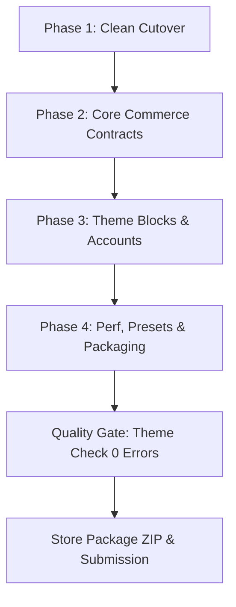

# Shopify Theme Store Modernization (2025–2026 Standards)

## Overview

Devs2 Rebel is an Online Store 2.0 Shopify base theme being prepared for official Shopify Theme Store submission. This plan executes the authoritative master architectural blueprint produced by the best-of-5 Ultra Verifier research pass, addressing all 4 strategic axes:
1. **Axis 1: Clean Cutover & Dead Code Purge:** Confirm clean Wishlist posture (zero client storage), purge dead Compare bar and checkboxes, and eliminate deceptive Coupon popup modals.
2. **Axis 2: Core Commerce Contracts & PDP Form:** Refactor add-to-cart submissions from synthetic JSON to native `FormData(this.form)` (preserving Gift Card recipient details and Subscription selling plans), fix quantity selector contracts, and deploy `<product-recommendations>` fetcher.
3. **Axis 3: Modern Liquid Architecture & Customer Accounts:** Modularize `sections/main-product.liquid` into `/blocks/*.liquid` (Theme Blocks with `` and nested blocks), integrate `<shopify-account>`, and upgrade to native Category Swatches & Combined Listings.
4. **Axis 4: Extreme Performance, Design System & Packaging:** Embed Speculation Rules API for instant 0ms page loads, apply CSS Subgrid on product cards (under strict 0 prefers-reduced-motion invariant), deliver 5 complete style presets in `settings_data.json`, and purge 58% schema bleed from `locales/en.default.json`.

## Scope & Non-Goals

- **In Scope:** Complete remediation of all Theme Store submission blockers, compliance with 2025–2026 standards, Theme Check 0 errors, full mobile/desktop accessibility, and package distribution readiness.
- **Non-Goals:** No full visual redesign; no custom app/backend creation; no weakening of existing test or validation rules; no violation of the zero `prefers-reduced-motion` invariant.

## Phases

| # | Phase | Priority | Effort | Status |
|---|-------|----------|--------|--------|
| 1 | [Phase 1: Clean Cutover & Dead Code Purge](./phase-01-clean-cutover-and-dead-code-purge.md) | P1 | 4h | Completed |
| 2 | [Phase 2: Commerce Contracts & PDP Form](./phase-02-commerce-contracts-and-pdp-form.md) | P1 | 6h | Pending |
| 3 | [Phase 3: Theme Blocks & Modern Liquid](./phase-03-theme-blocks-and-modern-liquid.md) | P1 | 8h | Pending |
| 4 | [Phase 4: Performance, Presets & Packaging](./phase-04-performance-presets-and-packaging.md) | P1 | 6h | Pending |

## Master Architecture Flow

## Success Criteria

- [x] All Compare bar, checkboxes, and `sessionStorage` logic purged without breaking `variant.compare_at_price` strikethrough.
- [x] Coupon preview, modal snippets, and custom elements removed from PDP and settings schema.
- [ ] PDP Add to Cart submits native `new FormData(form)` via `fetch('/cart/add.js')`, successfully passing gift card recipient fields and subscription selling plans.
- [ ] `sections/main-product.liquid` reduced from 1,090 lines down to ~275 lines using `/blocks/*.liquid`.
- [ ] `<shopify-account>` web component integrated into desktop header and mobile drawer.
- [ ] Variant swatches upgraded to native `value.swatch.color`, `value.swatch.image`, and `value.product_url`.
- [ ] Speculation Rules API prerendering configured in `snippets/head-script.liquid` for sub-100ms navigation.
- [ ] CSS Subgrid applied on product cards with zero `prefers-reduced-motion` overrides.
- [ ] 5 distinct style presets (Rebel, Noir, Vibrant, Botanical, Cyber) fully defined in `config/settings_data.json`.
- [ ] 2,114 lines of schema bleed purged from `locales/en.default.json` (75KB -> 31KB).
- [ ] Range Math AST validator passes with 0 errors (`(max - min) % step == 0`).
- [ ] `shopify theme check` reports 0 errors / 0 offenses.

<!-- slug: shopify-theme-store-modernization -->
