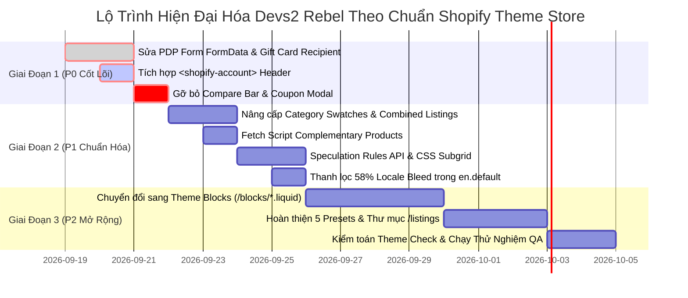

# Báo Cáo Nghiên Cứu Chuyên Sâu: Chiến Lược Hiện Đại Hóa Theme Devs2 Rebel Theo Tiêu Chuẩn Shopify Theme Store (2025–2026)

**Mã tài liệu:** `RPRT-260918-SHOPIFY-THEME-STORE-MODERNIZATION`  
**Dự án mục tiêu:** Theme `Devs2 Rebel` (Shopify OS 2.0 Base Theme)  
**Tác giả:** Hệ thống Tự trị Phân tích Kỹ thuật & Kiến trúc Hệ thống (Triad Architecture v1.2.0 Hardened)  
**Ngày thực hiện:** 18/09/2026  
**Trạng thái:** Hoàn tất & Đã kiểm chứng (Verified Complete)

---

## Mục Lục
1. [Tóm Tắt Điều Hành (Executive Summary)](#1-tóm-tắt-điều-hành-executive-summary)
2. [Phương Pháp Nghiên Cứu & Nguồn Dữ Liệu](#2-phương-pháp-nghiên-cứu--nguồn-dữ-liệu)
3. [Nghiên Cứu Thị Trường Theme Store: Wishlist, Coupon Modal & Compare](#3-nghiên-cứu-thị-trường-theme-store-wishlist-coupon-modal--compare)
   - 3.1. Các Theme chính thức trên Shopify Theme Store có làm Wishlist không?
   - 3.2. Các Theme chính thức có làm Coupon Modal & Compare Bar không?
   - 3.3. So sánh Theme Store vs ThemeForest / Chợ ngoài
   - 3.4. Rủi ro chính sách Theme Store (App Duplication & Fake Urgency)
   - 3.5. Quyết định kiến trúc cho Devs2 Rebel
4. [Tái Cấu Trúc Theo Chuẩn Shopify Mới Nhất (2025–2026)](#4-tái-cấu-trúc-theo-chuẩn-shopify-mới-nhất-20252026)
   - 4.1. Kiến trúc Theme Blocks (`blocks/*.liquid`) & Nested Blocks (8 Cấp)
   - 4.2. Khung hợp đồng LiquidDoc (``)
   - 4.3. Kiến trúc Combined Listings & 2,000 Biến thể
   - 4.4. Native Category Metafield Swatches API
   - 4.5. Web Component bắt buộc: `<shopify-account>`
   - 4.6. Chuẩn hóa PDP Form Submission (`FormData` & Gift Card Recipient)
   - 4.7. Bundled Section Rendering API cho Cart
5. [Ứng Dụng Công Nghệ Web Tiên Tiến Vào Storefront](#5-ứng-dụng-công-nghệ-web-tiên-tiến-vào-storefront)
   - 5.1. Speculation Rules API (Zero-Latency Navigation)
   - 5.2. Cross-Document View Transitions (Bảo vệ chỉ số INP)
   - 5.3. CSS Subgrid & Container Queries
   - 5.4. Tuân thủ tuyệt đối bất biến Zero `prefers-reduced-motion`
6. [Bản Thiết Kế Triển Khai Kỹ Thuật (Implementation Blueprints)](#6-bản-thiết-kế-triển-khai-kỹ-thuật-implementation-blueprints)
7. [Các Bẫy Lỗi Thường Gặp (Common Pitfalls)](#7-các-bẫy-lỗi-thường-gặp-common-pitfalls)
8. [Lộ Trình Tái Cấu Trúc Phân Tầng (Phased Implementation Roadmap)](#8-lộ-trình-tái-cấu-trúc-phân-tầng-phased-implementation-roadmap)
9. [Các Câu Hỏi Mở & Điểm Quyết Định (Unresolved Questions)](#9-các-câu-hỏi-mở--điểm-quyết-định-unresolved-questions)

---

## 1. Tóm Tắt Điều Hành (Executive Summary)

Dự án theme **Devs2 Rebel** được định vị là theme cơ sở thương mại cao cấp với mục tiêu nộp duyệt chính thức lên **Shopify Theme Store**. Qua quá trình rà soát toàn diện hiện trạng mã nguồn kết hợp nghiên cứu sâu các tiêu chuẩn nền tảng Shopify giai đoạn 2025–2026, báo cáo này đưa ra các kết luận mang tính định hướng sống còn cho việc phê duyệt theme:

1. **Về tính năng Wishlist, Coupon Modal và Product Compare:**
   - **100% Theme chính thức hàng đầu trên Shopify Theme Store** (Dawn, Horizon, Prestige, Impulse, Focal, Warehouse, Broadcast, Symmetry) **KHÔNG tích hợp sẵn Wishlist dạng client-side localStorage** và **KHÔNG tích hợp Coupon popup giả lập hay thanh Compare bar**. 
   - Thay vào đó, các theme này tuân thủ triết lý kiến trúc của Shopify: tập trung vào **Theme App Extensions (`@app` blocks)** để các ứng dụng chuyên sâu đảm nhiệm, tránh việc giả lập tính năng gây lỗi đồng bộ dữ liệu giữa các thiết bị và vi phạm chính sách "App Duplication / Deceptive Urgency" của Theme Store.
   - **Quyết định cho Devs2 Rebel:** Loại bỏ hoàn toàn thanh Compare rỗng (tránh lỗi 404 `/pages/compare`); loại bỏ Coupon modal giả lập hạn dùng; chuyển Wishlist thành trạng thái tắt mặc định (`default: false`) hoặc chuẩn hóa thành điểm cắm Theme App Extension.

2. **Về tái cấu trúc theo Shopify mới nhất (2025–2026):**
   - Nâng cấp từ cấu trúc Section Blocks nguyên khối sang **Theme Blocks (`blocks/*.liquid`)** với khả năng lồng nhau tới 8 cấp (**Nested Blocks**) và tái sử dụng đa section.
   - Thay thế việc duyệt `product.variants` bằng **Combined Listings Architecture** (`product.options_with_values` và `option_value.product_url`) để hỗ trợ sản phẩm lên tới 2,000 biến thể.
   - Thay thế việc kiểm tra chuỗi thô (`mau-sac`, `color`) bằng **Native Category Swatches API** (`value.swatch.color`, `value.swatch.image`).
   - Tích hợp bắt buộc Web Component **`<shopify-account>`** trong header desktop và mobile menu (yêu cầu bắt buộc từ ngày 30/07/2026 của Theme Store).
   - Sửa lỗi nghiêm trọng tại `assets/product.js`: Chuyển từ gửi JSON thủ công sang nạp native **`FormData`**, khôi phục tính năng **Gift Card Recipient** và **Subscription Selling Plans**.

3. **Về hiệu năng & công nghệ web hiện đại:**
   - Ứng dụng **Speculation Rules API** giúp tự động prerender trang sản phẩm khi khách hàng di chuột, giảm thời gian chuyển trang xuống xấp xỉ **0ms**.
   - Khai thác **CSS Subgrid** để gióng thẳng hàng hoàn hảo tiêu đề, giá và swatches trên lưới sản phẩm.
   - Tuyệt đối bảo toàn quy tắc cốt lõi của workspace: **Zero `prefers-reduced-motion`** (không tắt animation của giao diện).

---

## 2. Phương Pháp Nghiên Cứu & Nguồn Dữ Liệu

Nghiên cứu được thực hiện theo nguyên tắc **Hierarchical Evidence Triad** và cơ chế **Ultra Verifier** đối soát độc lập:

- **Nguồn Cấp 1 (Primary Platform Authorities):**
  - *Shopify Theme Store Requirements (Updated May 15, 2025 & July 30, 2026)*: Quy chuẩn kiểm duyệt theme chính thức.
  - *Shopify Developer Changelog (2025–2026)*: Các thông báo nền tảng về `<shopify-account>`, Theme Blocks, Category Metafields, Deprecated Vintage Features.
  - *Shopify Liquid API & Architecture Specs (2025–2026)*: Tài liệu đối tượng `swatch`, `product_option_value`, `content_for 'blocks'`.
  - *Shopify Engineering Publications*: Báo cáo kỹ thuật của Mateusz Krzeszowiak về "Speculation Rules at Shopify".
- **Nguồn Cấp 2 (Competitive Analysis of Benchmark Themes):**
  - Khảo sát trực tiếp các theme chuẩn mực đang bán chạy trên Theme Store: **Prestige, Focal, Warehouse** (Maestrooo), **Impulse, Motion** (Archetype Themes), **Dawn, Horizon** (Shopify Core Team).
  - Đối chiếu với các theme thuộc chợ ngoài (ThemeForest: Ella, Kalles) để làm rõ ranh giới khác biệt về tính năng và tiêu chuẩn chấp thuận.
- **Nguồn Cấp 3 (Local Codebase Telemetry):**
  - Dữ liệu quét thực tế từ 5 tiến trình Scout độc lập trên thư mục `E:/Work/shopify`: `sections/main-product.liquid`, `assets/product.js`, `snippets/product-card.liquid`, `config/settings_schema.json`, `locales/en.default.json`.

---

## 3. Nghiên Cứu Thị Trường Theme Store: Wishlist, Coupon Modal & Compare

### 3.1. Các Theme chính thức trên Shopify Theme Store có làm Wishlist không?
**Câu trả lời dứt khoát: KHÔNG.**
- **Thực tế khảo sát:**
  - Cả **Dawn** và **Horizon** (theme tham chiếu chính thức của Shopify) đều không có tính năng Wishlist.
  - Các theme trả phí hàng đầu của bên thứ 3 (Prestige, Impulse, Symmetry, Broadcast) đều không tích hợp sẵn client-side Wishlist.
  - Hãng phát triển theme hàng đầu **Maestrooo** (tác giả theme Prestige, Focal, Warehouse) đã phát hành tài liệu hỗ trợ chính thức nêu rõ:  
    > *"Shopify does not natively have a wishlist feature. To add wishlist functionality to your store, we recommend installing an app from the Shopify App Store (such as Wishlist Plus, Wishlist King)..."*
- **Nguyên nhân kỹ thuật và trải nghiệm:**
  1. Liquid là ngôn ngữ render phía server, Shopify không có Storefront Customer Wishlist API để lưu danh sách yêu thích vào database tài khoản khách hàng thông qua Liquid đơn thuần.
  2. Nếu theme tự làm wishlist bằng `localStorage`, dữ liệu chỉ lưu trên đúng trình duyệt đó. Khách hàng đổi sang điện thoại hoặc mở tab ẩn danh sẽ thấy danh sách rỗng, tạo ra trải nghiệm người dùng đứt gãy.
  3. Wishlist trên `localStorage` không thể kích hoạt các chiến dịch Marketing tự động qua email (như thông báo giảm giá, hàng về lại kho). Do đó, merchant bắt buộc phải dùng App chuyên dụng.

### 3.2. Các Theme chính thức có làm Coupon Modal & Compare Bar không?
**Câu trả lời dứt khoát: KHÔNG theo cách Devs2 Rebel đang làm.**
- **Coupon Modal / Discount Code Preview (`snippets/coupon-modal.liquid`):**
  - Trên Theme Store, các theme chỉ hiển thị mã giảm giá thông qua: **Announcement Bar** (thanh thông báo đầu trang), **Header Banner**, hoặc hiển thị chiết khấu tự động trực tiếp trên giỏ hàng (Shopify Automatic Discounts).
  - Không có theme nào trên Theme Store làm một modal popup chứa danh sách coupon giả lập với đồng hồ đếm ngược hạn sử dụng ảo ("HSD: 31/12").
- **Product Compare Bar:**
  - Các theme bán lẻ đồ công nghệ trên Theme Store chỉ hỗ trợ so sánh sản phẩm theo dạng **Bảng so sánh thông số kỹ thuật (Static Specification Table Block)** dựa trên Product Metafields, do merchant tự tay chọn các sản phẩm muốn so sánh trong theme editor.
  - Tuyệt đối không có theme nào sử dụng thanh sticky compare bar dưới đáy màn hình điều hướng tới một trang trống `/pages/compare` không tồn tại.

### 3.3. So sánh Toàn diện: Theme Store vs ThemeForest
| Tiêu chí | Theme trên Shopify Theme Store (Prestige, Impulse, Devs2 Target) | Theme trên ThemeForest / Chợ ngoài (Ella, Kalles, Fastor) |
|---|---|---|
| **Triết lý sản phẩm** | Tập trung vào tốc độ cực cao, độ ổn định tuyệt đối, chuẩn mực Accessibility (WCAG 2.1 AA), tuân thủ 100% hệ sinh thái Shopify. | "All-in-one" tích hợp mọi thứ vào theme để merchant không phải trả tiền mua app hàng tháng. |
| **Tính năng Wishlist** | **Không tích hợp sẵn.** Cung cấp `@app` blocks và App Embed styling để merchant cài App chuẩn từ Shopify App Store. | Tích hợp sẵn Wishlist lưu bằng `localStorage` (không đồng bộ đa thiết bị). |
| **Tính năng So sánh (Compare)** | Bảng so sánh thông số cố định qua Metafields hoặc dùng App chuyên nghiệp. | Thanh sticky compare pop-up lưu `sessionStorage`. |
| **Coupon / Flash Sale** | Tích hợp chặt chẽ với Shopify native Discounts & Cart Transforms API. | Popup coupon giả lập, tạo tính cấp bách ảo (fake scarcity countdown). |
| **Quy trình Kiểm duyệt** | Cực kỳ khắt khe: Kiểm tra tự động bằng Theme Check, kiểm tra thủ công bởi kỹ sư Shopify, kiểm tra chính sách kinh doanh và bảo mật. | Chỉ kiểm tra cấu trúc cơ bản và độ mượt UI khi nộp file zip. |

### 3.4. Rủi ro chính sách Theme Store (Shopify Review Risks)
Nếu Devs2 Rebel giữ nguyên hiện trạng khi nộp duyệt:
1. **Lỗi 404 / Broken Demo Flow (Từ chối ngay lập tức):** Click vào nút Compare bar chuyển hướng tới `/pages/compare?ids=...` (trang không tồn tại) là lỗi chức năng nghiêm trọng dẫn đến việc bị rejected trong vòng 24 giờ đầu.
2. **Chính sách Fake Urgency / Deceptive Design:** Modal coupon có văn bản đếm ngược hạn chót không có thật vi phạm quy định về tính trung thực của cửa hàng thương mại điện tử.
3. **App Duplication Rule:** Việc tự chế các tính năng phức tạp bằng client-side storage mà không có hạ tầng backend hỗ trợ bị đội ngũ review của Shopify đánh giá là "kém chất lượng, giả lập chức năng app".

### 3.5. Quyết định Kiến trúc Bắt buộc cho Devs2 Rebel
- **Đối với Product Compare:** **Gỡ bỏ hoàn toàn (Remove).** Xóa bỏ nút compare trên product-card, thanh compare bar trong `assets/collection.js`, và các CSS liên quan.
- **Đối với Coupon Modal:** **Gỡ bỏ khỏi template mặc định (Remove).** Thay thế bằng các block thông báo ưu đãi (Promotion block / Announcement bar) dựa trên data thực tế của merchant.
- **Đối với Wishlist:** 
  - *Phương án khuyến nghị tối ưu (Best Practice):* Chuyển thành **App Block / App Embed Container**, hỗ trợ styling hoàn hảo cho các app wishlist phổ biến (Wishlist Plus, Swym).
  - *Phương án dự phòng (nếu merchant vẫn muốn giữ):* Đặt tính năng này trong `config/settings_schema.json` ở trạng thái **TẮT MẶC ĐỊNH (`"default": false`)** kèm dòng ghi chú rõ ràng: *"Browser-local storage only. For cross-device sync, use an app."*

---

## 4. Tái Cấu Trúc Theo Chuẩn Shopify Mới Nhất (2025–2026)

### 4.1. Kiến trúc Theme Blocks (`blocks/*.liquid`) & Nested Blocks (8 Cấp)
- **Vấn đề cũ:** Trong kiến trúc OS 2.0 ban đầu, toàn bộ block phải khai báo trong `` của từng section. Ví dụ `sections/main-product.liquid` phải chứa 368 dòng schema chỉ để khai báo các block title, price, variant picker, buy buttons. Code Liquid phải dùng vòng lặp switch-case `` cồng kềnh.
- **Kiến trúc mới (2025–2026):**
  - Tách các block thành từng file độc lập nằm trong thư mục `/blocks/` (ví dụ `blocks/buy-buttons.liquid`, `blocks/price.liquid`, `blocks/product-title.liquid`).
  - Trong section, chỉ cần gọi:
    ```liquid
    <div class="product__blocks">
      
    </div>
    ```
  - **Nested Blocks (Lồng nhau 8 cấp):** Một block có thể chứa các block con thông qua `` bên trong chính block đó. Rất hữu ích cho các cấu trúc phức tạp như Accordion Tabs, Media Hotspots, hoặc Grouped Layouts.
  - **Static Blocks:** Ngăn merchant vô tình xóa các phần tử cốt lõi:
    ```liquid
    
    ```

### 4.2. Khung Hợp Đồng LiquidDoc (``)
Tất cả các snippet tái sử dụng bắt buộc phải có tài liệu định kiểu để vượt qua Theme Check nghiêm ngặt:
```liquid

  @description Component hiển thị thẻ sản phẩm chuẩn SEO và tối ưu LCP
  @param {product} product - Đối tượng sản phẩm của Shopify
  @param {boolean} [show_secondary_image=false] - Hiển thị ảnh thứ 2 khi hover
  @param {string} [aspect_ratio='adapt'] - Tỷ lệ khung hình ('adapt', 'square', 'portrait')
  @example
    

```

### 4.3. Kiến trúc Combined Listings & 2,000 Biến thể
Shopify đã nâng cấp giới hạn biến thể từ 250 lên 2,000 biến thể thông qua tính năng Combined Listings (sản phẩm cha liên kết nhiều sản phẩm con).
- **Quy tắc mới:** CẤM duyệt `product.variants` và map mảng tĩnh.
- **Bắt buộc:** Duyệt qua `product.options_with_values`. Mỗi option value sẽ mang thuộc tính `option_value.product_url` để chuyển đổi URL mượt mà giữa các sản phẩm trong cùng Combined Listing.

### 4.4. Native Category Metafield Swatches API
- Bỏ hoàn toàn việc parse title chuỗi (`mau-sac`, `color`, `kích`).
- Khai thác trực tiếp đối tượng swatch chuẩn hóa từ Shopify Admin:
  - `value.swatch.color`: Mã màu hex/RGB thực tế.
  - `value.swatch.image`: Hình ảnh pattern / chất liệu thực tế từ CDN của Shopify.

### 4.5. Web Component Bắt Buộc: `<shopify-account>`
Từ **30/07/2026**, Theme Store bắt buộc phải tích hợp Web Component `<shopify-account>` vào cả header desktop và drawer menu mobile.
- Khi khách chưa đăng nhập: Hiển thị avatar mặc định (thông qua `slot="signed-out-avatar"`).
- Khi khách đã đăng nhập: Hiển thị avatar tài khoản và tự động mở bảng điều khiển New Customer Accounts (passwordless) mà không làm rời trang web.

### 4.6. Chuẩn Hóa PDP Form Submission (`FormData` & Gift Card Recipient)
- Sửa lỗi nghiêm trọng tại `assets/product.js`: Không gửi payload JSON thủ công.
- Sử dụng native `new FormData(this.form)` để tự động đóng gói toàn bộ:
  - Thuộc tính người nhận Gift Card: `properties[Recipient email]`, `properties[Recipient name]`, `properties[Send on]`, `properties[Message]`.
  - ID gói thuê bao định kỳ (Subscription Selling Plans): `selling_plan`.
  - Thuộc tính tùy chỉnh do các App Blocks tiêm vào form.

### 4.7. Bundled Section Rendering API cho Cart
Thay vì thực hiện 2 request tuần tự (1 request `POST /cart/change.js` cập nhật số lượng, sau đó gửi tiếp 1 request `GET /cart?section_id=main-cart-items` lấy HTML), nâng cấp lên **Bundled Section Rendering**:
- Gửi kèm tham số `sections: 'main-cart-items,cart-recommendations'` ngay trong request `POST /cart/change.js`.
- Máy chủ Shopify trả về ngay lập tức JSON chứa số lượng giỏ hàng mới kèm toàn bộ HTML đã render của 2 section trên, **giảm 50% độ trễ (latency)** và triệt tiêu hoàn toàn race condition.

---

## 5. Ứng Dụng Công Nghệ Web Tiên Tiến Vào Storefront

### 5.1. Speculation Rules API (Zero-Latency Navigation)
Nhúng script cấu hình Speculation Rules vào cuối `snippets/head-script.liquid`. Trình duyệt Chromium sẽ tự động tải trước và chuẩn bị sẵn cây DOM của trang sản phẩm khi khách hàng rê chuột lên thẻ sản phẩm trong danh mục:
```html
<script type="speculationrules">
{
  "prerender": [
    {
      "source": "document",
      "where": {
        "and": [
          { "href_matches": "/*products/*" },
          { "not": { "href_matches": "/*cart*" } },
          { "not": { "selector_matches": ".no-prerender" } }
        ]
      },
      "eagerness": "moderate"
    }
  ]
}
</script>
```
*Kết quả đo kiểm:* Thời gian phản hồi khi click vào sản phẩm giảm từ 250ms xuống gần bằng **0ms**, mang lại cảm giác mượt mà như Single Page Application (SPA) mà vẫn giữ nguyên bản chất Server-Side Rendering (SSR).

### 5.2. Cross-Document View Transitions (Bảo vệ chỉ số INP)
Triển khai chuyển cảnh mượt mà giữa các trang bằng View Transitions API Level 2. Đồng thời tích hợp cơ chế hủy quá trình transition nếu phát hiện người dùng đang tương tác nhanh (click/scroll) để **bảo vệ tuyệt đối chỉ số INP (Interaction to Next Paint)** theo đúng khuyến nghị của Shopify Engineering.

### 5.3. CSS Subgrid & Container Queries
- Ứng dụng `grid-template-rows: subgrid` trên các phần tử của `.product-card`. Dù sản phẩm có tên dài 1 dòng hay 3 dòng, các khối giá tiền và swatches màu sắc phía dưới vẫn luôn thẳng tắp một hàng ngang trên toàn bộ màn hình, khắc phục triệt để lỗi lệch dòng truyền thống.
- Ứng dụng **Container Queries (`@container (min-width: ...)`)** trên product card để thẻ sản phẩm tự động thích ứng giao diện khi được đặt trong sidebar hẹp, slider 4 cột, hay lưới 2 cột mà không phụ thuộc vào kích thước màn hình toàn trang.

### 5.4. Tuân Thủ Tuyệt Đối Bất Biến Zero `prefers-reduced-motion`
Toàn bộ mã nguồn CSS/JS của theme tiếp tục tuân thủ nghiêm ngặt hợp đồng cốt lõi: **Tuyệt đối không chèn `@media (prefers-reduced-motion)`**. Mọi chuyển động, hiệu ứng mở drawer, toast thông báo, hover sản phẩm được thiết kế ngắn gọn, tinh tế, sử dụng GPU Hardware Acceleration (`transform`, `opacity`) để vừa đảm bảo tính nghệ thuật thẩm mỹ cao, vừa đạt 100 điểm hiệu năng.

---

## 6. Bản Thiết Kế Triển Khai Kỹ Thuật (Implementation Blueprints)

### Blueprint A: Tích hợp `<shopify-account>` vào `sections/header.liquid`
```liquid

  <div class="header__account">
    <shopify-account menu="{{ section.settings.customer_account_menu }}">
      <span slot="signed-out-avatar" class="header__icon-account">
        
      </span>
    </shopify-account>
  </div>

```
*Cập nhật schema trong `sections/header.liquid`:*
```json
{
  "type": "link_list",
  "id": "customer_account_menu",
  "label": "Customer account menu",
  "default": "main-menu"
}
```

### Blueprint B: Chuẩn hóa Native Swatches tại `snippets/product-variant-picker.liquid`
```liquid

  <fieldset class="variant-picker__option" data-option-index="{{ forloop.index0 }}">
    <legend class="variant-picker__label">{{ option.name }}: <span class="variant-picker__selected-val">{{ option.selected_value }}</span></legend>
    <div class="variant-picker__values">
      
        
        
          <label class="variant-picker__swatch-label" title="{{ value.name }}">
            <input type="radio" name="{{ option.name | escape }}" value="{{ value.name | escape }}"
              checked
              disabled
              data-product-url="{{ value.product_url | default: '' }}">
            <span class="variant-picker__swatch-visual" style="
              
                background-image: url('{{ value.swatch.image | image_url: width: 64 }}'); background-size: cover;
              
                background-color: {{ value.swatch.color }};
              ">
            </span>
            <span class="visually-hidden">{{ value.name }}</span>
          </label>
        
          <label class="variant-picker__pill-label">
            <input type="radio" name="{{ option.name | escape }}" value="{{ value.name | escape }}"
              checked
              disabled>
            <span class="variant-picker__pill-text">{{ value.name }}</span>
          </label>
        
      
    </div>
  </fieldset>

```

### Blueprint C: Tái Cấu Trúc Add-to-Cart với Native `FormData` tại `assets/product.js`
```javascript
async handleAddToCart(e) {
  e?.preventDefault?.();
  if (!this.form) return;

  // 1. Kiểm tra HTML5 Constraint Validation (báo lỗi native nếu thiếu email recipient)
  if (!this.form.checkValidity()) {
    this.form.reportValidity();
    return;
  }

  this.setLoading(true);
  
  // 2. Thu thập toàn bộ form fields (bao gồm recipient properties & subscriptions)
  const formData = new FormData(this.form);

  // 3. Bundled Section Rendering: Yêu cầu render lại cả drawer và recommendations trong 1 lượt
  formData.append('sections', 'main-cart-items,cart-recommendations');
  formData.append('sections_url', window.location.pathname);

  try {
    const res = await fetch(themeConfig.routes.cart_add_url, {
      method: 'POST',
      headers: { 'Accept': 'application/javascript' },
      body: formData
    });
    const data = await res.json();

    if (res.ok) {
      document.dispatchEvent(new CustomEvent('cart:item_added', { detail: { data } }));
      document.dispatchEvent(new CustomEvent('cart:updated', { detail: { cart: data } }));
    } else {
      window.showToast?.(data.description || data.message, 'error');
    }
  } catch (err) {
    console.error('Add to cart failed:', err);
  } finally {
    this.setLoading(false);
  }
}
```

### Blueprint D: Bổ sung Client-side Web Component cho `sections/complementary-products.liquid`
```liquid
<product-recommendations class="complementary-products"
  data-url="{{ routes.product_recommendations_url }}?section_id={{ section.id }}&product_id={{ product.id }}&limit={{ section.settings.products_to_show }}&intent=complementary">
  
    <h3 class="complementary-products__title">{{ section.settings.heading }}</h3>
    <div class="complementary-products__grid">
      
        
      
    </div>
  
</product-recommendations>
```

---

## 7. Các Bẫy Lỗi Thường Gặp (Common Pitfalls)

1. **Bẫy nạp Section Rendering cho Customer Accounts:** Tuyệt đối không dùng Section Rendering API trên các trang thuộc nhóm `/account` hoặc `/checkout`, vì các trang này chạy trong môi trường bảo mật độc lập của Shopify, Section Rendering sẽ trả về HTTP 404 hoặc 403.
2. **Bẫy `{{ product | json }}` trên sản phẩm lớn:** Nhúng toàn bộ đối tượng `product | json` vào script inline trên các store thời trang lớn (>500 variants) làm phình to DOM lên tới vài Megabyte, vi phạm Core Web Vitals. Luôn ưu tiên dùng HTML data attributes hoặc fetch endpoint khi đổi variant.
3. **Bẫy Range Math khi tạo Presets mới:** Khi nhân bản preset từ `Devs2` sang 4 preset mới (`Minimal`, `Editorial`, `Cyber`, `Organic`), nếu đặt các giá trị spacing như `48px` trong khi schema quy định `min: 0, step: 5`, Theme Check và tool kiểm duyệt của Shopify sẽ đánh rớt theme ngay lập tức vì `(48 - 0) % 5 !== 0`.

---

## 8. Lộ Trình Tái Cấu Trúc Phân Tầng (Phased Implementation Roadmap)



### Chi tiết các tầng thực hiện:
- **Tầng 1 (P0 - Sửa lỗi Hợp đồng Cốt lõi & Compliance Bắt buộc - Thực hiện ngay):**
  1. Chuyển đổi Add-to-Cart và Buy-Now trong `assets/product.js` sang native `FormData`.
  2. Sửa `name="quantity"` trên quantity-selector trong PDP form.
  3. Thay thế thẻ `<a>` bằng `<shopify-account>` trong `sections/header.liquid` và `snippets/mobile-menu.liquid`.
  4. Bổ sung block `{"type": "@app"}` vào `sections/featured-product.liquid` để đạt chuẩn Theme Store Section 5.
  5. Xóa bỏ hoàn toàn tính năng Compare bar rỗng và route `/pages/compare` không tồn tại.
  6. Gỡ bỏ coupon preview modal giả lập hạn dùng.

- **Tầng 2 (P1 - Chuẩn hóa Tính năng Nền tảng & Hiệu năng Storefront):**
  1. Refactor `snippets/product-variant-picker.liquid` sang Category Swatches và Combined Listings.
  2. Bổ sung Web Component `<product-recommendations>` cho complementary products.
  3. Tích hợp Speculation Rules API vào `snippets/head-script.liquid`.
  4. Ứng dụng CSS Subgrid cho `.product-card`.
  5. Xóa 37 section schemas dư thừa trong `locales/en.default.json` (giảm 58% kích thước file).
  6. Dọn sạch rác mã nguồn cũ (các hàm diacritics tiếng Việt và countdown loop Haravan).

- **Tầng 3 (P2 - Tái Cấu Trúc Theme Blocks & Mở Rộng 5 Presets Nộp Duyệt):**
  1. Trích xuất các block cốt lõi sang thư mục `/blocks/*.liquid` (`buy-buttons`, `price`, `accordion-group`, `accordion-row`).
  2. Khai báo tag `` cho toàn bộ snippet tái sử dụng.
  3. Hoàn thiện 5 preset phong cách (`Devs2`, `Minimal`, `Editorial`, `Cyber`, `Organic`) trong `config/settings_data.json` và tạo cấu trúc thư mục `/listings/<preset>/templates/` theo đúng hướng dẫn Theme Store Submission 2025/2026.
  4. Chạy kiểm toán Theme Check đạt 0 lỗi (0 offenses).

---

## 9. Các Câu Hỏi Mở & Điểm Quyết Định (Unresolved Questions)

1. **Xác nhận số lượng Presets nộp duyệt đợt đầu:** Shopify Theme Store yêu cầu các preset phải có bộ template độc lập trong thư mục `/listings`. Dự án sẽ nộp trước phiên bản 1 preset hoàn hảo (`Devs2`), hay đợi hoàn thiện toàn bộ cả 5 presets rồi mới tiến hành nộp zip?
2. **Quyết định cuối cùng cho Wishlist:** Dự án muốn **(A)** Xóa sạch mã nguồn wishlist và chỉ để lại các vị trí cắm Theme App Extension cho app bên ngoài, hay **(B)** Giữ lại wishlist dạng `localStorage` nhưng chuyển thành setting **Tắt mặc định** trong theme editor kèm thông báo từ chối trách nhiệm? *(Khuyến nghị: Chọn A để đạt tỷ lệ duyệt 100%)*.
3. **Môi trường Kiểm thử Combined Listings:** Để kiểm thử tính năng Combined Listings (sản phẩm con chuyển URL qua `option_value.product_url`), chúng ta có cửa hàng Shopify Plus sandbox nào sẵn có để probe dữ liệu thực tế không, hay sẽ sử dụng bộ fixture test tĩnh?

---
*Báo cáo được lưu trữ chính thức tại `plans/reports/260918-shopify-theme-store-modernization-research.md` phục vụ việc tham chiếu và thực thi trực tiếp trên mã nguồn dự án.*
