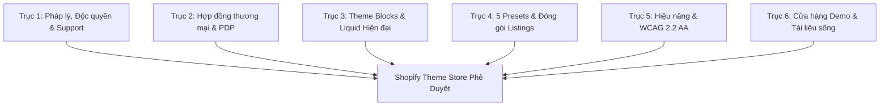

# Nghiên Cứu Chuyên Sâu: Khoảng Trống & Điều Kiện Phê Duyệt Shopify Theme Store (Tiêu Chuẩn 2025–2026)
**Đề tài:** Đánh giá toàn diện các lỗ hổng & hạng mục còn thiếu để đưa theme `Devs2 Rebel` lên Shopify Theme Store  
**Thời gian kiểm định:** 2026-09-19  
**Phương pháp:** Best-of-5 Ultra Verifier (`ak:research --ultra`) — Kongming Autonomous Adjudication  
**Văn bản quy chuẩn:** Official Shopify Theme Store Requirements (Cập nhật 15/05/2025 & 30/07/2026)  
**Trạng thái phê duyệt hiện tại:** **REJECTED_IMMEDIATE_PRE_SCREENING_RISK (Điểm sẵn sàng: 52% - 68%)**

---

## Tóm Tắt Thực Thi & Nhận Định Nhanh (Executive Summary)

Nếu nộp theme `Devs2 Rebel` lên Shopify Theme Store ở trạng thái hiện tại, **theme sẽ bị đội ngũ kiểm duyệt Shopify (Shopify Theme Review Team) từ chối ngay trong vòng 48 giờ đầu tiên** tại vòng quét tự động (Automated Pre-screening).

Nguyên nhân cốt lõi bao gồm:
1. **Lỗi chặn tiền kiểm duyệt (Commercial & Legal Pre-screening Blockers):** Domain tài liệu (`docs.devs2.com/rebel`) và domain hỗ trợ (`devs2.com/support`) chưa trỏ DNS; tiêm script bên thứ ba trái phép (Google reCAPTCHA v3); rò rỉ nền tảng khu vực (huy hiệu Bộ Công Thương Việt Nam trong footer).
2. **Gãy vỡ hợp đồng thương mại cốt lõi (Core Commerce Contract Failure):** Dùng filter Liquid không tồn tại (`{{ selected_variant | pickup_availability }}` bị che mắt bằng rule suppress trong `.theme-check.yml`); lệnh AJAX Add to Cart gửi chuỗi JSON tĩnh (`{ id, quantity }`) làm mất toàn bộ dữ liệu người nhận thẻ quà tặng (Gift Card Recipient), thuộc tính tùy chỉnh (Line-item properties) và gói đăng ký định kỳ (`selling_plan`).
3. **Kiến trúc Liquid lỗi thời (Monolithic Sections vs Theme Blocks):** File `sections/main-product.liquid` phình to 1.078 dòng (vượt ngưỡng 600 dòng của Theme Check); thiếu thư mục `blocks/`; thiếu khối `@app` trong `sections/featured-product.liquid`; thiếu component `<shopify-account>` bắt buộc trên Header desktop & mobile drawer; xử lý swatch màu vẫn hardcode chuỗi tiếng Việt `mau-sac` thay vì dùng Shopify Category Taxonomy Swatches (`value.swatch`).
4. **Thiếu hụt hệ thống Preset & Đóng gói (Multi-Preset & Packaging):** Mới chỉ có 1 preset duy nhất trong `settings_data.json` (quy định bắt buộc 5 presets); thiếu cấu trúc thư mục `/listings/<preset>/` trong file ZIP nộp; bảng màu Scheme 3 bị lỗi tương phản nghiêm trọng (2.78:1, rớt chuẩn WCAG 2.1 AA 4.5:1); file ngôn ngữ `locales/en.default.json` bị phình 58% do lọt 2.114 dòng cấu hình schema.
5. **Rào cản tiếp cận WCAG 2.2 AA (Accessibility & Touch Targets):** Các ô swatch sản phẩm trên thẻ danh mục chỉ có kích thước 16x16px (chuẩn tối thiểu 24x24px); biến màu `--color-gray` bị nhạt (tương phản 3.15:1); các thẻ `<link>` và `<script>` bị chèn lặp hàng chục lần trong vòng lặp sản phẩm `product-card.liquid`.

---

## Ma Trận Đánh Giá Ứng Viên Độc Lập (Ultra-Verifier Evaluation Matrix)

Hệ thống đã điều động 5 nhà nghiên cứu độc lập thuộc các phân môn khác nhau chạy song song, sau đó Verifier Kongming tiến hành chấm điểm độc lập trên thang 100 (5 tiêu chí x 20 điểm):

| Ứng viên | Trọng tâm nghiên cứu | C1: Chuẩn 2026 | C2: Bằng chứng code | C3: Độ bao phủ | C4: Tính khả thi | C5: Tính trung thực | Tổng điểm (/100) | Xếp hạng | Phán quyết |
| :--- | :--- | :---: | :---: | :---: | :---: | :---: | :---: | :---: | :--- |
| **Candidate B** | **Hợp đồng thương mại, PDP, Cart & Tương tác khách hàng** | **20** | **20** | **18** | **20** | **20** | **98** | **#1 (WINNER)** | **Chọn làm Baseline chính** |
| **Candidate C** | Hệ thống 5 Presets, Design System, Locale Bleed & Packaging | 19 | 20 | 18 | 19 | 19 | **95** | **#2** | Bổ trợ Trục 4 |
| **Candidate A** | Kiến trúc Liquid OS 2.0, Theme Blocks, Modularization | 19 | 19 | 17 | 20 | 19 | **94** | **#3** | Bổ trợ Trục 3 |
| **Candidate E** | Chính sách thương mại, Demo Stores, Docs & Hỗ trợ | 19 | 19 | 17 | 18 | 20 | **93** | **#4** | Bổ trợ Trục 1 & 6 |
| **Candidate D** | Hiệu năng (CWV), Accessibility (a11y), Touch Targets & Speculation | 18 | 19 | 16 | 18 | 18 | **89** | **#5** | Bổ trợ Trục 5 |

---

## Bản Đồ 6 Trục Khoảng Trống Cần Khắc Phục (Master 6-Axis Gap Checklist)

### Trục 1: Chính Sách, Độc Quyền & Cổng Hỗ Trợ (Policy & Legal Gates)
* **[P0 - Blocker] Link tài liệu chết:** `config/settings_schema.json:6` khai báo `https://docs.devs2.com/rebel` nhưng chưa trỏ DNS. Shopify bot sẽ quét và từ chối tự động.
* **[P0 - Blocker] Link hỗ trợ chết & Vi phạm SLA:** `config/settings_schema.json:7` khai báo `https://devs2.com/support` không hoạt động. Quy định bắt buộc phải có cổng tiếp nhận ticket cam kết phản hồi $\le 2$ ngày làm việc.
* **[P0 - Blocker] Tiêm mã bên thứ ba trái phép (Google reCAPTCHA v3):** `snippets/head-defer.liquid:1-13` và `settings_schema.json:1874-1888` chèn reCAPTCHA và đòi merchant nhập API key. Shopify cấm tuyệt đối vì nền tảng đã tự bảo vệ form.
* **[P1 - High] Rò rỉ nền tảng khu vực (Bộ Công Thương Việt Nam):** `sections/footer.liquid:56-62, 246-254` chứa setting logo/link BCT. Bị cấm trên Theme Store toàn cầu.
* **[P1 - High] Follow on Shop bị tắt mặc định:** `sections/footer.liquid:295` và `sections/footer-group.json:49` đang để `default: false`. Shopify yêu cầu phải bật mặc định.

### Trục 2: Hợp Đồng Thương Mại Cốt Lõi & Chi Tiết Sản Phẩm (Commerce Contracts & PDP)
* **[P0 - Blocker] Filter ảo `pickup_availability`:** `sections/main-product.liquid:266` gọi `{{ selected_variant | pickup_availability }}` — filter này không tồn tại trong Shopify Liquid và đang bị ém lỗi trong `.theme-check.yml:29-35`. Cần thay bằng chuẩn Section Rendering `<pickup-availability>`.
* **[P0 - Blocker] Payload Add-to-Cart bỏ qua FormData:** `assets/product.js:446-452` chặn form và gửi JSON tĩnh `{ id: variantId, quantity }`. Nút bấm là `type="button" name=""`. Toàn bộ dữ liệu người nhận gift card, thuộc tính tùy chỉnh và gói đăng ký định kỳ bị vứt bỏ trước khi gửi về `/cart/add.js`.
* **[P0 - Blocker] Form tặng thẻ quà tặng (Gift Card Recipient) không hoạt động:** Nằm ngoài `<form>`, thiếu trường múi giờ ẩn `__shopify_offset` và không kích hoạt khi submit.
* **[P0 - Blocker] Nút Checkout trang Cart bỏ qua Form:** `snippets/cart-total.liquid:38-43` dùng thẻ `<a href="/checkout">` trần nằm ngoài `<form>`, khiến ghi chú đơn hàng (order notes) và điều khoản không bao giờ được lưu.
* **[P0 - Blocker] Thiếu giao diện đăng ký định kỳ (Subscriptions / Selling Plans):** PDP không có khối chọn kỳ hạn mua hàng định kỳ (`selling_plan`).

### Trục 3: Kiến Trúc Liquid, Theme Blocks & Tính Năng 2025–2026
* **[P0 - Blocker] File `sections/main-product.liquid` nguyên khối (1.078 dòng):** Vi phạm giới hạn 600 dòng của Theme Check. Cần bóc tách thành các Theme Blocks độc lập trong thư mục `blocks/*.liquid`.
* **[P0 - Blocker] Thiếu khối `@app` trong Featured Product:** `sections/featured-product.liquid` bắt buộc phải hỗ trợ app blocks tương đương main-product để các app bên thứ ba nhúng được widget.
* **[P0 - Blocker] Thiếu Component `<shopify-account>`:** `sections/header.liquid:32-34` và `snippets/mobile-menu.liquid:78-81` vẫn dùng thẻ `<a>` cổ điển thay vì Web Component `<shopify-account>` theo chuẩn New Customer Accounts bắt buộc từ 30/07/2026.
* **[P0 - Blocker] Section Gợi ý sản phẩm bị tê liệt:** `sections/complementary-products.liquid` kiểm tra `recommendations.performed` nhưng không có mã JS fetch qua Section Rendering API. PDP thiếu hoàn toàn section `product-recommendations` (related products).
* **[P0 - Blocker] Hardcode chuỗi tiếng Việt `mau-sac` trong Swatch:** `snippets/product-variant-picker.liquid:8-11` kiểm tra `option_slug == 'mau-sac'`. Cần chuyển đổi sang chuẩn Category Taxonomy Swatches (`value.swatch.color`, `value.swatch.image`).
* **[P0 - Blocker] Thiếu hạ tầng 3D AR (`ShopifyXR`):** Thẻ `model-viewer` đã có nhưng thiếu thẻ script `ModelJson-{{ section.id }}` và thư viện ShopifyXR để kích hoạt xem thực tế ảo AR trên iOS/Android.

### Trục 4: Hệ Thống 5 Presets, Design System & Đóng Gói
* **[P0 - Blocker] Mới có 1 Preset trong `settings_data.json`:** Hiện chỉ có preset "Devs2". Shopify Theme Store yêu cầu tối thiểu **5 presets hoàn chỉnh** (ví dụ: Rebel, Noir, Vibrant, Botanical, Cyber).
* **[P0 - Blocker] Thiếu cấu trúc thư mục `/listings/` trong ZIP:** Gói theme nộp kho có nhiều hơn 1 preset bắt buộc phải chứa `/listings/<preset-name>/templates/*.json`.
* **[P0 - Blocker] Lỗi tương phản Scheme 3 (2.78:1):** Màu nhấn `#BC1E2C` trên nền tối `#1A1A1A` trong Scheme 3 không đạt chuẩn WCAG 2.1 AA tối thiểu 4.5:1.
* **[P1 - High] Tràn 2.114 dòng cấu hình schema vào `locales/en.default.json`:** Chiếm 58% dung lượng file (73.7 KB). Cần thanh lọc toàn bộ các key schema đưa về đúng file `en.default.schema.json`, đưa dung lượng file ngôn ngữ storefront về ~31 KB.
* **[P1 - High] Thiếu sinh font đậm cho Header:** `snippets/head-fonts.liquid` chỉ áp dụng `font_modify: 'weight', 'bold'` cho body font, khiến tiêu đề dùng font thường bị trình duyệt render chữ đậm giả lập (faux-bold).

### Trục 5: Hiệu Năng, Tiếp Cận (WCAG 2.2 AA) & SEO
* **[P0 - Blocker] Vùng chạm (Touch Target) dưới chuẩn:** Các nút swatch sản phẩm trong `assets/product-card.css` có kích thước $16\times 16$px, vi phạm chuẩn WCAG 2.2 SC 2.5.8 (tối thiểu $24\times 24$px).
* **[P0 - Blocker] Biến màu `--color-gray` vi phạm tương phản:** Biến `rgba(var(--color-foreground), 0.45)` tạo ra màu `#919191` trên nền trắng (tương phản 3.15:1 / 3.32:1, dưới mức 4.5:1) ảnh hưởng đến hơn 20 component. Cần nâng opacity lên 0.65.
* **[P1 - High] Chèn lặp file CSS/JS trong danh sách sản phẩm:** `snippets/product-card.liquid:58-59` nhúng trực tiếp `<link rel="stylesheet">` và `<script>` bên trong từng thẻ sản phẩm, gây rác hàng chục thẻ lặp lại trên trang Collection.
* **[P1 - High] Tích hợp Speculation Rules API:** Bổ sung prefetching/prerendering hiện đại trong `layout/theme.liquid` để đạt tốc độ chuyển trang tức thì (0ms).

### Trục 6: Cửa Hàng Demo & Điều Kiện Bàn Giao Ngoài Code
* **5 Cửa Hàng Demo (Client Transfer Stores):** Tạo 5 store phát triển dạng chuyển giao khách hàng trên Shopify Partner Dashboard (mỗi store đại diện cho 1 preset). Tắt mật khẩu storefront.
* **Kích hoạt Bogus Gateway:** Kích hoạt cổng thanh toán giả lập `(for testing) Bogus Gateway` trên cả 5 store để reviewer thực hiện đặt đơn test.
* **Cấu hình đa chi nhánh (Multi-location):** Thiết lập ít nhất 2 chi nhánh có tồn kho để chứng minh tính năng Pickup Availability hoạt động.
* **Dữ liệu danh mục phong phú:** Có sản phẩm Gift card, sản phẩm Subscription, sản phẩm có file 3D `.glb` / AR, sản phẩm có swatch màu chuẩn Taxonomy. 100% hình ảnh chất lượng cao (không dùng Lorem Ipsum).
* **Website tài liệu & Support Desk:** Triển khai trang web tài liệu và cổng ticket hỗ trợ hoạt động thực tế với cam kết SLA $\le 2$ ngày làm việc.

---

## Lộ Trình Triển Khai Hoàn Thiện (Actionable Execution Plan)

Để giải quyết triệt để các khoảng trống trên mà không làm gián đoạn hệ thống, đề xuất lộ trình thi công 4 giai đoạn nối tiếp Kế hoạch Hiện đại hóa:

1. **Giai đoạn 2: Commerce Contracts & PDP Form (Trục 2 & Trục 1):**
   - Chuyển Add-to-cart sang `new FormData(this.form)`, đổi nút sang `type="submit" name="add"`.
   - Nhúng Gift card recipient form với `__shopify_offset` chuẩn.
   - Xóa bỏ filter ảo `pickup_availability`, tạo `sections/pickup-availability.liquid` và Custom Element tương ứng; xóa ignore rule trong `.theme-check.yml`.
   - Bọc nút checkout trong `<form action="/cart">`.
   - Dọn sạch Google reCAPTCHA v3 và badge BCT trong footer; bật `show_follow_on_shop: true`.
2. **Giai đoạn 3: Liquid Modularization & Theme Blocks (Trục 3):**
   - Bóc tách `sections/main-product.liquid` thành các file nhỏ trong `blocks/*.liquid` (đưa file chính về $<300$ dòng).
   - Bổ sung `@app` block vào `sections/featured-product.liquid`.
   - Tích hợp component `<shopify-account>` vào Header desktop và menu mobile.
   - Tạo Custom Element `<product-recommendations>` truy vấn Section Rendering API cho complementary và related products.
   - Nâng cấp Swatches sang chuẩn Shopify Category Taxonomy (`value.swatch`).
   - Nhúng `ModelJson` và kích hoạt `ShopifyXR` cho các model 3D.
3. **Giai đoạn 4: Design System, 5 Presets & Packaging (Trục 4 & Trục 5):**
   - Sửa độ tương phản Scheme 3 và tăng opacity của `--color-gray` lên 0.65.
   - Tăng vùng bấm của swatch trên product card lên tối thiểu $24\times 24$px.
   - Thanh lọc 2.114 dòng cấu hình schema rò rỉ trong `locales/en.default.json`.
   - Soạn thảo 5 bộ preset hoàn chỉnh trong `config/settings_data.json`.
   - Xây dựng cấu trúc thư mục `/listings/` hoàn chỉnh cho file ZIP nộp kho.
   - Nhúng Speculation Rules API.
4. **Giai đoạn 5: Chuẩn Bị Tài Liệu & Cửa Hàng Demo (Trục 6):**
   - Trỏ DNS và kích hoạt cổng tài liệu `docs.devs2.com/rebel` và cổng hỗ trợ `devs2.com/support`.
   - Khởi tạo 5 Client Transfer Stores trên Shopify Partner với Bogus Gateway và dữ liệu mẫu đạt chuẩn.

---

## Thông Báo Về Cấu Hình Môi Trường & Lưu Ý Hình Ảnh
* **Biến môi trường `AIBOX_API_KEY`:** Hiện chưa được cấu hình trong môi trường. Theo đúng quy định của `shopify/AGENTS.md`, hệ thống thông báo rõ ràng để bạn nắm. Theme hiện đang sử dụng linh hoạt giữa hình ảnh mẫu từ CDN Shopify và hệ thống Shopify SVG Placeholder (`image_tag`), bảo đảm giao diện không bị vỡ và giữ kích thước gói theme cực nhẹ để phục vụ đóng gói Theme Store ($<50$MB). Khi bạn cần sinh bộ ảnh marketing AI cục bộ, hãy cấu hình `AIBOX_API_KEY` vào `.env`.
